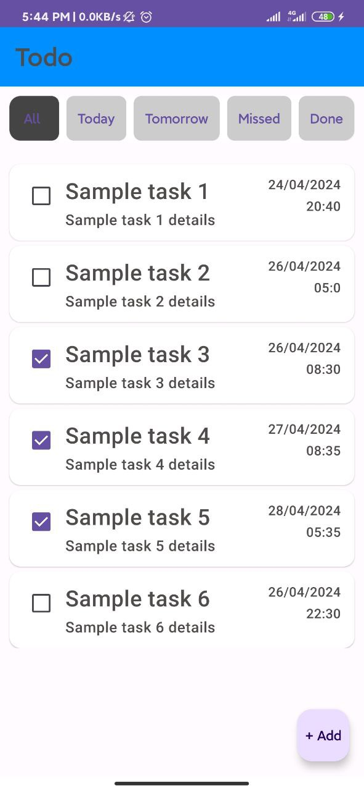
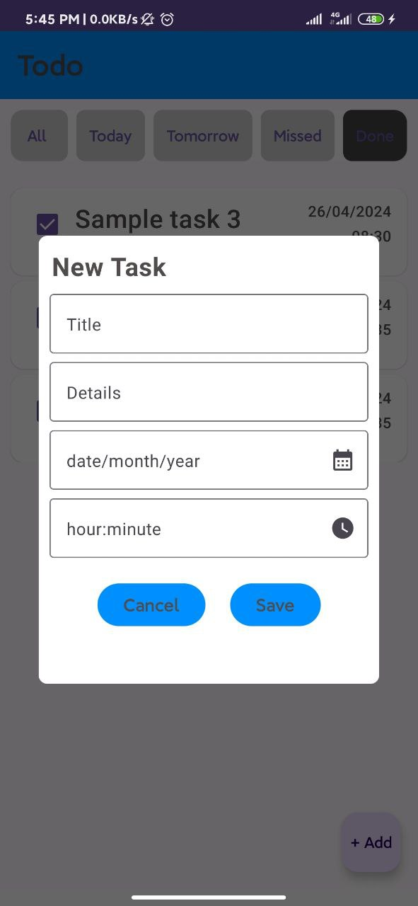
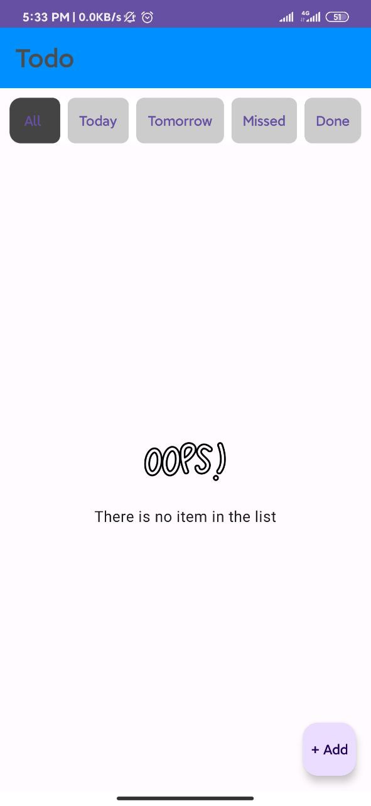
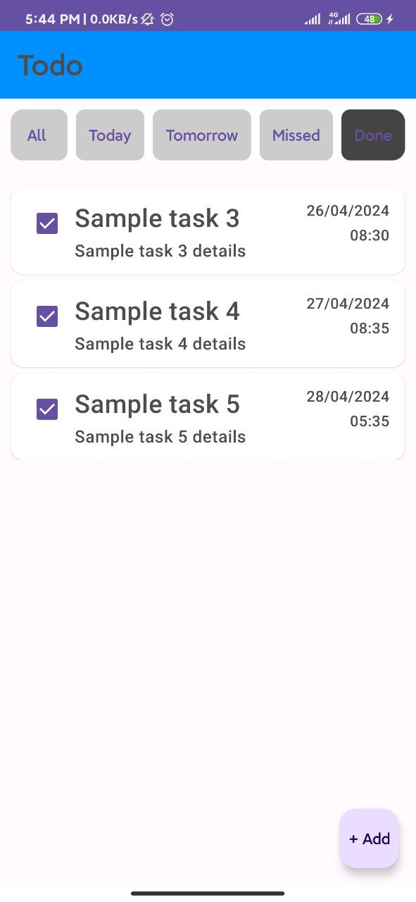

# 📝 Todo App

A simple and intuitive **Todo Android App** built using **Kotlin** and **Jetpack Compose** that helps users manage tasks effectively with deadline tracking and filtering features.

---

## 🚀 Key Features

- ✅ Add new todo items with a deadline
- ❌ Delete existing todo items(By swipping)
- 📅 Select deadline using **Date & Time Picker**
- 🔍 Filter tasks:
  - **Today**
  - **Tomorrow**
  - **Missed**
  - **Done**
- 🗃️ Scrollable task list using **LazyColumn**
- 🗄️ Persistent storage using **Room Database**

---

## 💻 Tech Stack

- **Language:** Kotlin
- **UI Toolkit:** Jetpack Compose
- **Architecture:** MVVM
- **Database:** Room (local persistence)
- **State Management:** ViewModel & State Hoisting
- **Utilities Used:**
  - Kotlin `data class`
  - Nullable type handling
  - Date & Time Picker

---

## 📸 Screenshots

| Task List | Add Todo | Empty List | Filtered View |
|-----------|----------|--------------------|----------------|
|  |  |  |  |

[🔗 View more screenshots](./screenshots/)

---

---

## 🛠️ Future Enhancements

- Notifications for upcoming and missed tasks
- Category tagging for tasks
- Task edit/update functionality
- Dark mode support

---

## 👨‍💻 Developer

**Md Rasel Rahman**  
📍 Jashore, Bangladesh  
📫 [LinkedIn](https://www.linkedin.com/in/rasel093/) | [GitHub](https://github.com/rasel-093)

---

> Feel free to clone, modify, and contribute to the project!

